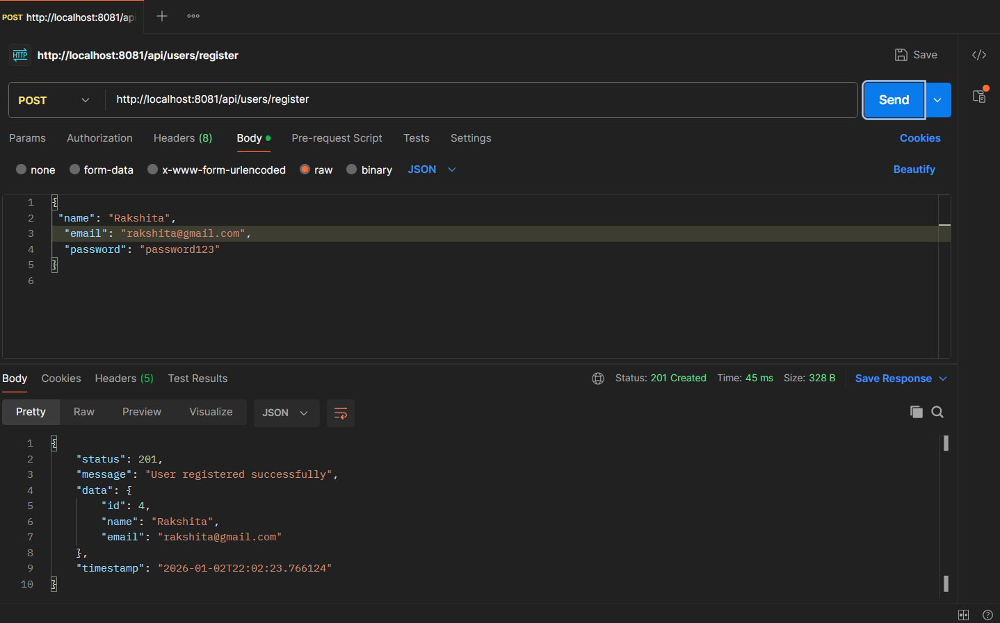

# User Registration API

A Spring Boot REST API built to demonstrate **clean backend design**, 
**request validation**, and **centralized exception handling**.

This project focuses on how APIs should **fail gracefully** with meaningful
error responses instead of exposing internal details.

---

## 🚀 Tech Stack
- Java 21
- Spring Boot
- Spring Data JPA (Hibernate)
- MySQL
- Maven

---

## ✨ Features
- User registration REST API
- Input validation using Bean Validation (`@Valid`)
- Centralized exception handling with `@ControllerAdvice`
- Proper HTTP status codes:
  - `201 Created`
  - `400 Bad Request`
  - `409 Conflict`
- Clean layered architecture (Controller, Service, Repository)
- Secure API responses using DTOs (no sensitive data exposure)

---

## 📌 API Endpoint

### Register User
**POST** `/api/users/register`

#### Request Body
{
  "name": "John Doe",
  "email": "john@example.com",
  "password": "password123"
}

Success Response (201 Created)
{
  "status": 201,
  "message": "User registered successfully",
  "data": {
    "id": 1,
    "name": "John Doe",
    "email": "john@example.com"
  },
  "timestamp": "2026-01-02T22:02:23"
}

## 📸 API Screenshots

### ✅ Successful Registration (201 Created)

### ❌ Validation Error (400 Bad Request)

### ⚠️ Duplicate Email (409 Conflict)

